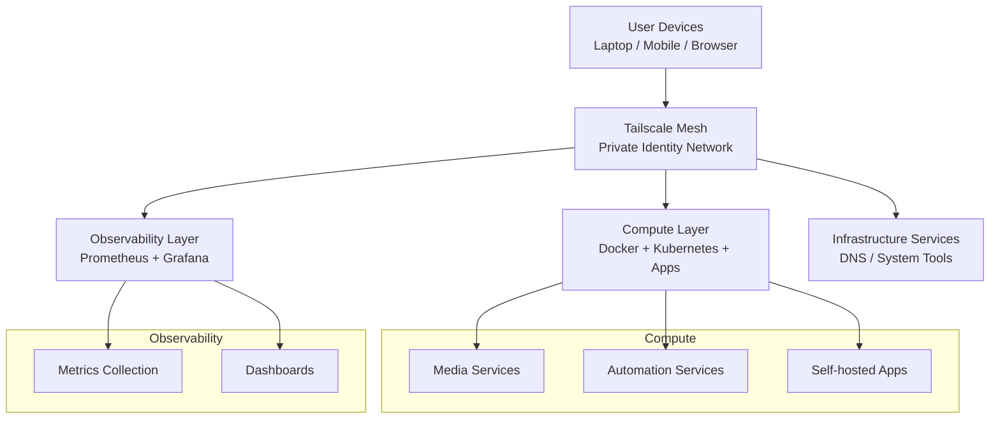

# Self-Hosted Platform Infrastructure

This repository defines a personal self-hosted infrastructure platform designed around a **private mesh networking model**, observability-first operations, and modular service deployment.

Rather than relying on traditional public ingress (e.g. reverse proxies), this platform uses **Tailscale as the primary network access layer**, enabling secure, identity-based access to all services.

---

## 🧭 Architecture Overview

The system is organized into three conceptual layers:

### 1. Compute Layer
Containerized services managed via Docker Compose and selective Kubernetes workloads.

Examples:
- Media services (Jellyfin, Navidrome, Audiobookshelf)
- Automation services (epub processing, file tools)
- Self-hosted applications (Nextcloud, Filebrowser)

---

### 2. Observability Layer
A centralized monitoring stack for metrics and system visibility.

- Prometheus: metrics collection and scraping
- Grafana: dashboards and visualization
- Service-level instrumentation via exporters (where available)

---

### 3. Network Access Layer (Tailscale Mesh)
All services are accessed through a private network mesh.

- No public service exposure by default
- Identity-based access via Tailscale
- Eliminates need for traditional reverse proxy ingress
- Secure service-to-service and user-to-service connectivity

---

## 🧱 Architecture Diagram




---

## 🚫 Legacy Architecture (Deprecated)

This system previously included a reverse proxy layer (nginx/caddy) for HTTP ingress and routing.

### Status: DEPRECATED

- Reverse proxy is **no longer part of active architecture**
- Replaced by Tailscale mesh networking
- Retained only for experimentation/reference

This shift reduces:
- TLS and certificate management complexity
- ingress routing surface area
- external exposure risk

---

## 🔐 Secrets Management

- No secrets are stored in version control
- Runtime configuration is injected via environment variables
- `.env`, keys, and certificates are excluded via `.gitignore`
- Service templates are provided where applicable

---

## 📡 Observability Goals

Current focus:
- Service health visibility
- System-level resource monitoring
- Basic dashboarding via Grafana

Future direction:
- OpenTelemetry instrumentation
- Distributed tracing across services
- Centralized log aggregation

---

## 🧠 Design Philosophy

This platform is intentionally designed to explore:

- Private-by-default infrastructure
- Minimal public attack surface
- Composable service architecture
- Observability as a first-class concern
- Practical self-hosted system design patterns

It serves as both a functional system and an evolving infrastructure experimentation environment.

---

## 🚀 Usage

All services are managed via `make` from the repo root.

### Start / Stop platform
```bash
make up        # start all services
make down      # stop all services
make restart   # restart all services
```

### Logs

```bash
make logs      # tail logs for all services
```

### Network setup

```bash
make network-setup
```

(Automatically runs as part of make up)

### Per-service commands

Generated for each service (e.g. jellyfin, navidrome, etc.):

```bash
make <service>-up
make <service>-down
make <service>-logs
make <service>-pull
make <service>-up-force
make <service>-down-vol
```

Example:
```bash
make jellyfin-up
make jellyfin-logs
```

### Reverse proxy (legacy)
```bash
make reverse-proxy-up
```
Note: only used for TLS bootstrap; core services use Tailscale for access.